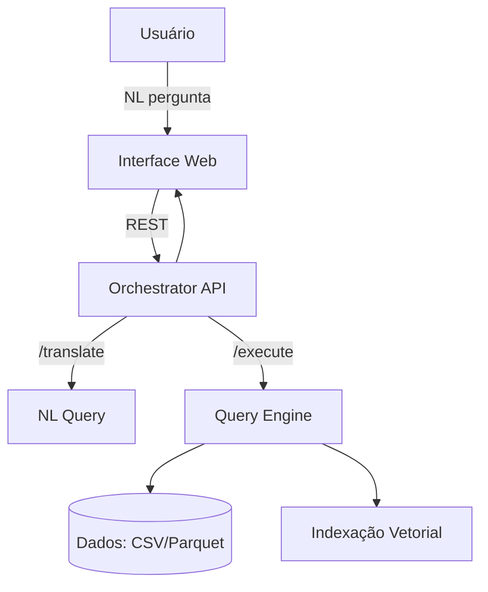

Arquitetura do Askadb

Visão geral
O Askadb é um banco analítico híbrido (relacional + vetorial) com camada nativa de linguagem natural, orquestração de serviços e UI para exploração.

Diagrama (Mermaid)

Componentes
- Interface Web: React + Vite
- Orchestrator API: FastAPI
- NL Query: FastAPI + LLM provider
- Query Engine: FastAPI + DuckDB
- Infra: Docker Compose para ambiente local

