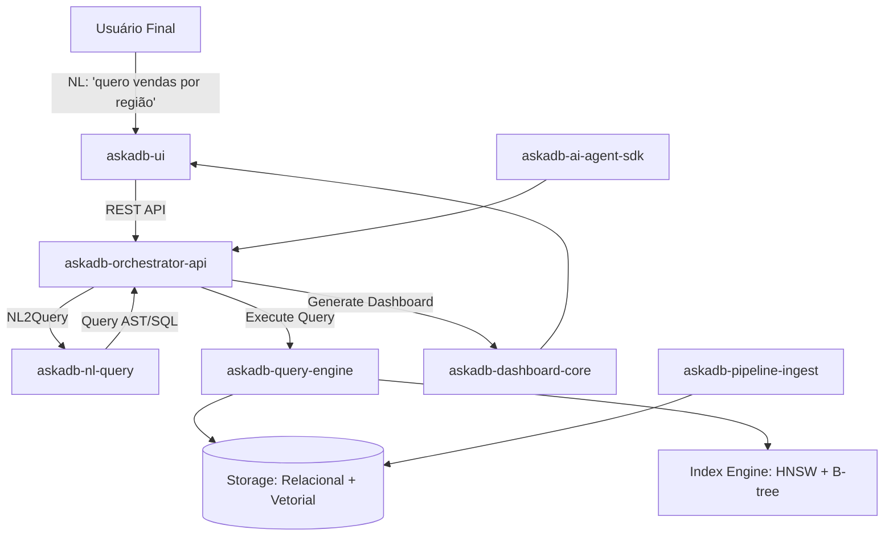

# Arquitetura do Askadb - Banco de Dados Revolucionário

## Visão Geral

O Askadb é um **banco de dados híbrido revolucionário** (relacional + vetorial) com camada nativa de linguagem natural, orquestração de serviços e UI para exploração. Focado em revolucionar o mercado para PMs, data engineers e startups de IA.

## 🎯 **Diferenciais Revolucionários**

### 1. **Query por Linguagem Natural Nativa**
- Camada NL2Query embutida no banco, sem intermediários
- "Quero vendas por região no mês de maio" → Query executada automaticamente
- Suporte a contexto e histórico de conversas

### 2. **Armazenamento Híbrido**
- **Relacional**: Dados estruturados tradicionais (tabelas, relacionamentos)
- **Vetorial**: Embeddings para busca semântica e RAG
- **Semi-estruturado**: JSON, documentos flexíveis

### 3. **Otimizador Semântico**
- Traduz NL em DAG de operações
- Cache inteligente baseado em padrões de uso
- Otimização automática de queries

### 4. **Dashboards Automáticos**
- Geração automática de visualizações
- Sugestões inteligentes de gráficos
- Templates personalizáveis

## 🏗️ **Arquitetura Detalhada**

## 🔧 **Componentes Principais**

### **askadb-query-engine** - Core do Banco
- **Storage Engine**: Armazenamento híbrido (relacional + vetorial)
- **Query Engine**: Parser + otimizador + executor
- **Index Engine**: Índices vetoriais (HNSW) + relacionais (B-tree)
- **Linguagem**: Rust/Go para performance

### **askadb-nl-query** - Camada de Linguagem Natural
- **NL2Query**: Transformação de linguagem natural em queries
- **Context Management**: Histórico e contexto de conversas
- **LLM Integration**: OpenAI, Llama, Claude
- **Linguagem**: Python (FastAPI + LangChain)

### **askadb-dashboard-core** - Visualizações Automáticas
- **Auto-charting**: Geração automática de gráficos
- **Template Engine**: Dashboards personalizáveis
- **Suggestion Engine**: Sugestões inteligentes de visualizações
- **Linguagem**: TypeScript/JavaScript

### **askadb-pipeline-ingest** - Ingestão de Dados
- **ETL Pipeline**: CSV, JSON, APIs externas
- **Data Validation**: Validação e limpeza automática
- **Schema Inference**: Detecção automática de schemas
- **Linguagem**: Python (Apache Airflow/Prefect)

### **askadb-ui** - Interface do Usuário
- **Query Interface**: Chat-like para queries em NL
- **Dashboard Builder**: Construtor visual de dashboards
- **Data Explorer**: Exploração interativa de dados
- **Linguagem**: React + TypeScript + Tailwind

### **askadb-orchestrator-api** - Orquestração
- **Service Coordination**: Coordenação entre todos os serviços
- **API Gateway**: Endpoint único para todas as operações
- **Authentication**: Autenticação e autorização
- **Linguagem**: Python (FastAPI)

### **askadb-ai-agent-sdk** - Integração com IA
- **LLM Agents**: SDK para agentes LLM
- **RAG Integration**: Retrieval Augmented Generation
- **Plugin System**: Plugins para LangChain, LlamaIndex
- **Linguagem**: Python/TypeScript

## 🚀 **Roadmap de Desenvolvimento**

### **Fase 1: MVP (3-6 meses)**
1. **Storage Engine Básico**: Armazenamento relacional simples
2. **NL2Query Simples**: Queries básicas em linguagem natural
3. **UI Mínima**: Interface para queries e visualizações básicas
4. **Pipeline de Ingestão**: Suporte a CSV/JSON

### **Fase 2: Híbrido (6-12 meses)**
1. **Storage Vetorial**: Embeddings e busca semântica
2. **Query Engine Avançado**: Otimizador semântico
3. **Dashboards Automáticos**: Geração automática de gráficos
4. **SDK para Agentes**: Integração com LLM agents

### **Fase 3: Revolucionário (12-18 meses)**
1. **RAG Nativo**: Chunking e embeddings automáticos
2. **Otimizador Inteligente**: Cache e otimização automática
3. **Plugins Ecosystem**: Marketplace de plugins
4. **Enterprise Features**: Multi-tenancy, segurança avançada

## 🎯 **Posicionamento no Mercado**

### **Diferenciais vs. Competidores**
- **vs. PostgreSQL**: NL2Query nativo + vetores
- **vs. ChromaDB**: Relacional + analítico
- **vs. MotherDuck**: NL2Query nativo + dashboards automáticos
- **vs. Weaviate**: Foco em PMs + interface intuitiva

### **Target Market**
- **PMs**: Queries em linguagem natural + dashboards automáticos
- **Data Engineers**: Pipelines automatizados + performance
- **Startups de IA**: SDK para agentes + RAG nativo
- **Analistas**: Interface intuitiva + visualizações automáticas

## 🔬 **Tecnologias Recomendadas**

### **Core (Performance)**
- **Storage Engine**: Rust (performance + segurança)
- **Query Engine**: Rust/Go (baixa latência)
- **Index Engine**: Rust (HNSW + B-tree)

### **AI/ML (Flexibilidade)**
- **NL2Query**: Python (FastAPI + LangChain)
- **Embeddings**: Python (sentence-transformers)
- **LLM Integration**: Python (OpenAI, Anthropic)

### **Frontend (UX)**
- **UI**: React + TypeScript + Tailwind
- **Charts**: D3.js + Chart.js
- **State**: Zustand/Redux

### **Infra (Escalabilidade)**
- **Orchestration**: Docker + Kubernetes
- **API**: gRPC + REST
- **Monitoring**: Prometheus + Grafana

